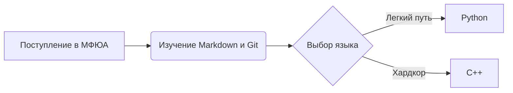

# Мой репозиторий
### Навигация
```
My-repositorie/
├── README.md # Главная страница проекта
├── src/
│   ├── README.md # Только заголовок
├── translations/
│   ├── README.md # Только заголовок
└── resources/ # Для изображений
    └── README.md # Только заголовок
```

# 🎓 Добро пожаловать в мой репозиторий для колледжа МФЮА!

> «Болтовня ничего не стоит. Покажите мне код». — *Линус Торвальдс*

---

## 📌 Навигатор по документу
* [Вступление](#-вступление)
* [Описание проекта](#-описание-проекта)
* [Мой прогресс](#-прогресс-обучения)
* [Сравнение языков](#-сравнение-языков)
* [Схема обучения](#-схема-обучения)

---

## 📝 Вступление
Здесь будут публиковаться мои лабораторные работы и практические задания, необходимые для учебы в колледже. Я обучаюсь на специальности **«Информационные системы и программирование»**. Моя цель — стать *высококлассным разработчиком* и освоить востребованный стек технологий.

---

## 📂 Навигатор по проекту
1. [Лабораторные работы и код](./src/README.md)
2. [Теория и переводы](./translations/README.md)
3. [Изображения и схемы](./translations/resources/README.md)

---

## 💻 Описание проекта
В процессе обучения я планирую писать приложения на разных языках программирования. Данный репозиторий является отправной точкой моего портфолио на GitHub.

### 🖼️ Мои изображения


---

## 🚀 Прогресс обучения
* *Научился базовому синтаксису Git*
* **Освоил форматирование текста**
* ~~Завалить первую сессию~~ Пройти практику на отлично!

👉 Подробнее о моих первых шагах можно почитать в [документе с переводами](./translations/README.md).

---

## ⚔️ Сравнение языков

| Язык | Сложность | Популярность | Применение |
| :--- | :---: | :---: | :---: |
| **Python** | 🐣 Низкая | 🔥 Высокая | AI / Backend |
| **C++** | 🧠 Высокая | 📈 Стабильная | Игры / Софт |

---

## 📊 Схема обучения



---

## 🛠️ Пример первого кода
```python
print("Привет МФЮА!")
```